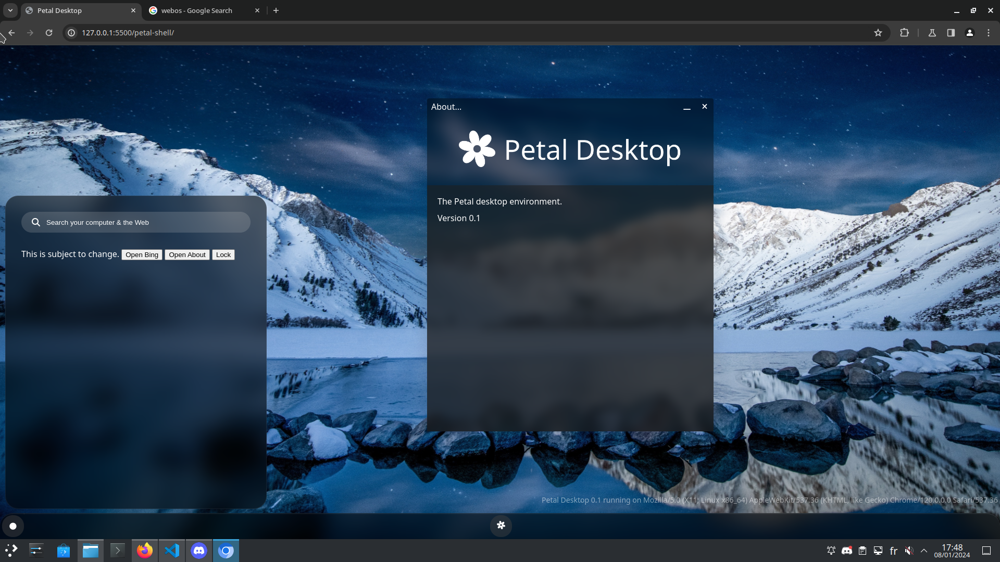

# Petal Desktop
Petal Desktop is a web-based desktop environment.

*Petal Desktop running on Chromium 123, on GNU/Linux*

## License
The Petal Desktop source code (including APIs) are licensed under the MIT License.